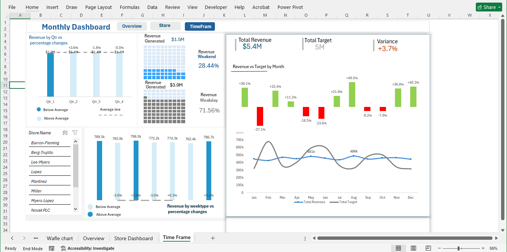
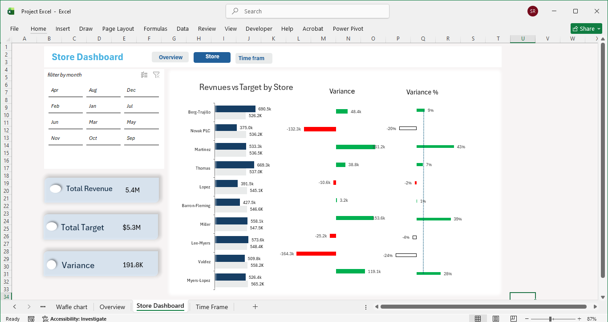

# Retail Sales Performance Dashboard (Excel)

## Overview
A multi-page interactive Excel dashboard tracking retail sales performance across stores, time frames, and product categories, with clickable navigation for a seamless user experience.

## Tools Used
Microsoft Excel (Advanced Formulas, Pivot Tables, Interactive Navigation)

## Dashboard Pages

### 1. Overview
KPI cards for Total Revenue (40.1k), COGS (293.0k), Profit Margin (17.5k), Profit Margin % (37.3%), and Refund Rate % (8.05%). Includes revenue breakdown by product category and gender, plus a Top 10 Products by Revenue chart and detailed product performance table.

### 2. Time Frame
Analyzes revenue by quarter with percentage changes vs. average, a waffle chart comparing weekend vs. weekday revenue generation, and store performance trends across months.

### 3. Store Dashboard
Compares Total Revenue ($485.8k) vs. Total Target ($326.1k) with variance analysis by store, highlighting top and underperforming locations through revenue-vs-target charts.

## Key Insights
- Identified top and underperforming stores through variance vs. target analysis
- Highlighted weekday vs. weekend revenue distribution patterns
- Segmented product performance by category and gender to guide inventory decisions# retail_sales_dashboard_excel
Excel Retail Sales Performance Dashboard
